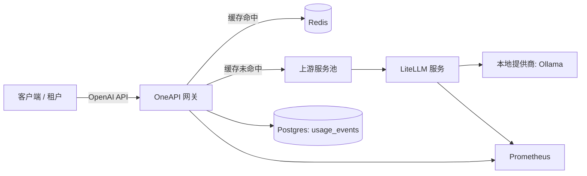

# 技术架构

## 组件

### LiteLLM 服务 (独立)
- 目的: 提供轻量级的兼容 OpenAI 规范的 API 层，支持可配置的底层提供商（本地或远程）。
- 职责:
  - 模型别名与白名单控制
  - OpenAI 标准接口 (`/v1/chat/completions`, `/v1/embeddings`, `/v1/models`)
  - 健康检查 + Prometheus 监控指标
  - 结构化的请求/延迟日志记录

### OneAPI 网关 (独立)
- 目的: 为个人使用和外部 API 访问提供统一的网关。
- 职责:
  - 鉴权认证 (API Keys, 基于 JWKS 的 OAuth JWT)
  - 速率限制 (基于 Redis，按主体制约)
  - 请求路由 + 负载均衡
  - 缓存层 (基于 Redis，针对确定性请求)
  - 跨上游服务的故障转移/熔断回退机制
  - 使用量分析 (Postgres) + 基础管理看板
  - 异步批处理 API (`/v1/batches`) + 异步 worker (可选)
  - 面向用户的 OpenAPI 文档 (`/docs`, `/openapi.json`)
  - Prometheus 监控指标

## 组合模式 (OneAPI → LiteLLM)

## 请求链路 (对话补全)
1. 客户端调用 OneAPI 的 `POST /v1/chat/completions`，携带以下任一凭证:
   - `Authorization: Bearer <api-key>`
   - `Authorization: Bearer <oauth-jwt>`
2. 网关对请求主体进行鉴权，并执行 RPM 速率限制（如果绑定了租户则按租户限流，否则按请求主体限流）。
3. 网关针对确定性调用（如 `temperature: 0`）计算缓存 Key，如果存在缓存则直接返回（同时支持流式和非流式返回）。
4. 网关选择一个上游服务（使用带有熔断跳过机制的轮询策略）并转发请求。
5. 遇到瞬时失败状态码或超时（429/502/503/504）时，网关会在一定次数内重试其他上游服务。
6. 网关在 Postgres 中记录一条使用事件日志，并导出监控指标。

## 配置项

### LiteLLM 专属参数
- 配置文件: [litellm.yaml](../config/litellm/litellm.yaml)
- 运行时环境变量:
  - `LITELLM_CONFIG_PATH`
  - `OLLAMA_HOST`

### OneAPI 网关设置
- 配置文件: [config/oneapi/oneapi.yaml](../config/oneapi/oneapi.yaml)
- 核心参数:
  - `auth_modes`, `api_keys`
  - `oauth.jwks_url`, `oauth.audience`, `oauth.issuer`
  - `upstreams`, `upstream_timeout_ms`
  - `rate_limit_rpm`
  - `cache.enabled`, `cache.ttl_seconds`
  - `model_map`

### 组合运行参数
- 组合模式环境模板: 已合并至各组件独立配置文件中
- 组合部署 K8s 清单: [k8s/combined](../k8s/combined)

## 可观测性

### 监控指标 (Prometheus)
- LiteLLM: `/metrics` 提供请求计数器和延迟直方图。
- OneAPI: `/metrics` 提供 HTTP 请求延迟 + 缓存命中率 + 上游请求计数器。

### 链路追踪
- 网关目前未实现分布式链路追踪的上下文透传；主要依赖上游/提供商日志和网关指标进行关联分析。

### 错误追踪
- 错误会被记录到 `usage_events.error` 字段中，并通过监控指标标签进行统计。

## 可用性与性能目标
- p95 延迟 < 500ms: 通过 Redis 缓存（针对符合条件的确定性请求）、Node fetch 的上游长连接 (keep-alive) 以及水平扩展来实现。
- 组合模式下 99.9% 可用性: 通过部署多个上游副本并在上游之间实现有界故障转移来实现。