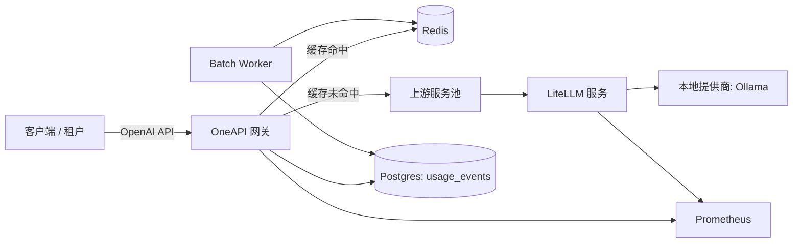

# 技术架构

## 组件

### LiteLLM 服务 (独立)
- 目的: 提供轻量级的兼容 OpenAI 规范的 API 层，支持可配置的底层提供商（本地或远程）。
- 职责:
  - 模型别名与白名单控制
  - OpenAI 标准接口 (`/v1/chat/completions`, `/v1/embeddings`, `/v1/models`)
  - 健康检查 + Prometheus 监控指标
  - 结构化的请求/延迟日志记录
  - 错误自愈（OOM 时自动卸载模型）

### OneAPI 网关 (独立)
- 目的: 为个人使用和外部 API 访问提供统一的网关。
- 职责:
  - 鉴权认证 (API Keys, 基于 JWKS 的 OAuth JWT)
  - 速率限制 (基于 Redis，RPM + TPM 双维度)
  - 请求路由 + 负载均衡（带熔断跳过机制的轮询策略）
  - 缓存层 (基于 Redis，针对确定性请求，支持 SSE 流式缓存回放)
  - 跨上游服务的故障转移/熔断回退机制（支持模型级别 fallback 回退）
  - 统一模型名映射（`models`）
  - 多租户管理（租户级 RPM/TPM 配额、禁用开关）
  - 使用量分析 (Postgres) + 管理看板
  - 异步批处理 API (`/v1/batches`) + 异步 worker
  - 内置聊天界面 (`/chat`) 与对话管理 API
  - 面向用户的 OpenAPI 文档 (`/docs`, `/openapi.json`)
  - Prometheus 监控指标 (TTFT/TPS/缓存命中率等)
  - Guardrails 安全防护（注入检测、内网 IP 拦截、PII 脱敏）

### Batch Worker (独立)
- 目的: 异步消费批处理任务队列
- 职责:
  - 从 Redis 队列获取 batch 任务
  - 使用 internal_token 通过网关执行子请求
  - 更新批次状态和单项结果到 Postgres

## 组合模式 (OneAPI → LiteLLM)

## 请求链路 (对话补全)
1. 客户端调用 OneAPI 的 `POST /v1/chat/completions`，携带以下任一凭证:
   - `Authorization: Bearer <api-key>`
2. 网关对请求主体进行鉴权，并执行 RPM/TPM 速率限制（如果绑定了租户则按租户限流，否则按请求主体限流）。
3. 网关对请求体执行 Guardrails 检查（注入检测、内网 IP 拦截），拦截则返回 400。
4. 网关针对确定性调用（如 `temperature: 0`）计算缓存 Key，如果存在缓存则直接返回（同时支持流式和非流式返回，流式命中后支持打字机回放）。
5. 网关选择一个上游服务（默认 LiteLLM，使用带熔断跳过机制的轮询策略）并转发请求。
6. 如果上游返回错误或超时，网关会返回统一的 OpenAI-compatible 错误格式。
7. 网关在 Postgres 中记录一条使用事件日志，并导出 Prometheus 监控指标。

## 配置项

### 统一配置
- 配置文件: [config/easyai.yaml](../config/easyai.yaml)
- 最小参数:
  - `app.env`, `app.port`, `app.log_level`
  - `secrets.admin_password`, `secrets.api_keys`, `secrets.internal_token`, `secrets.postgres_password`
  - `providers.*`：上游供应商地址和密钥
  - `models.*`：客户端可见模型名到真实供应商模型的映射

### 组合运行参数
- 组合模式配置: 已合并到 `config/easyai.yaml` 和 `docker-compose.yml`
- 组合部署入口: [docker-compose.yml](../docker-compose.yml)

## 可观测性

### 监控指标 (Prometheus)
- LiteLLM: `/metrics` 提供请求计数器和延迟直方图。
- OneAPI: `/metrics` 提供 HTTP 请求延迟 + TTFT/TPS + 缓存命中率 + 上游请求计数器。

### 链路追踪
- 网关会透传上游请求的 `traceparent` header，支持与外部追踪系统配合实现分布式链路追踪。

### 错误追踪
- 错误会被记录到 `usage_events.error` 字段中，并通过监控指标标签进行统计。

## 可用性与性能目标
- p95 延迟 < 500ms: 通过 Redis 缓存（针对符合条件的确定性请求）、Node fetch 的上游长连接 (keep-alive) 以及水平扩展来实现。
- 组合模式下 99.9% 可用性: 通过部署多个上游副本并在上游之间实现有界故障转移来实现。
