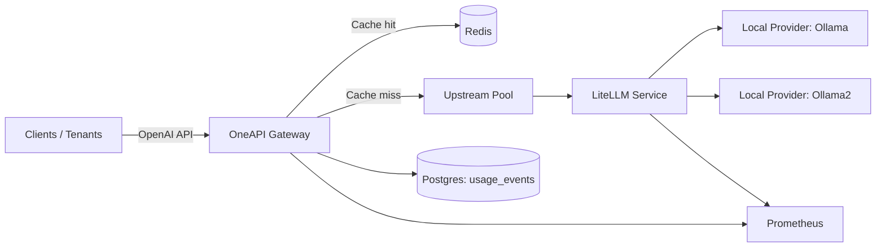

# Technical Architecture

## Components

### LiteLLM Service (standalone)
- Purpose: lightweight OpenAI-compatible API surface backed by configurable providers (local or remote).
- Responsibilities:
  - Model aliasing and allow-listing
  - OpenAI endpoints (`/v1/chat/completions`, `/v1/embeddings`, `/v1/models`)
  - Health + Prometheus metrics
  - Structured request/latency logging

### OneAPI Gateway (standalone)
- Purpose: unified gateway for personal use and external API access.
- Responsibilities:
  - Authentication (API keys, OAuth JWT via JWKS)
  - Rate limiting (Redis, per principal)
  - Request routing + load balancing
  - Cache layer (Redis) for deterministic requests
  - Failover/circuit-breaker style fallback across upstreams
  - Usage analytics (Postgres) + basic dashboard
  - Batch API (`/v1/batches`) + async worker (optional)
  - Prometheus metrics

## Combined Mode (OneAPI → LiteLLM)

## Request Flow (Chat Completions)
1. Client calls `POST /v1/chat/completions` on OneAPI with either:
   - `Authorization: Bearer <api-key>`, or
   - `Authorization: Bearer <oauth-jwt>`
2. Gateway authenticates principal and enforces RPM (per tenant if bound, otherwise per principal).
3. Gateway computes a cache key for deterministic calls (`temperature: 0`) and returns cached result if present (supports both streaming and non-streaming).
4. Gateway selects an upstream (round-robin with circuit-breaker skip) and forwards the request.
5. On transient failure codes/timeouts (429/502/503/504), gateway retries other upstreams (bounded attempts).
6. Gateway records a usage event in Postgres and exports metrics.

## Configuration

### LiteLLM-specific parameters
- Config file: [litellm.yaml](../config/litellm/litellm.yaml)
- Runtime env:
  - `LITELLM_CONFIG_PATH`
  - `OLLAMA_HOST`

### OneAPI gateway settings
- Env template: [oneapi.env.example](../config/oneapi/oneapi.env.example)
- Key parameters:
  - `ONEAPI_AUTH_MODE`, `ONEAPI_API_KEYS`
  - `ONEAPI_OAUTH_JWKS_URL`, `ONEAPI_OAUTH_AUDIENCE`, `ONEAPI_OAUTH_ISSUER`
  - `ONEAPI_UPSTREAMS`, `ONEAPI_UPSTREAM_TIMEOUT_MS`
  - `ONEAPI_RATE_LIMIT_RPM`
  - `ONEAPI_CACHE_ENABLED`, `ONEAPI_CACHE_TTL_SECONDS`
  - `ONEAPI_MODEL_MAP`

### Combined operation parameters
- Combined env template: [config/combined/env.example](../config/combined/env.example)
- Combined deployment manifests: [k8s/combined](../k8s/combined)

## Observability

### Metrics (Prometheus)
- LiteLLM: `/metrics` with request counters and latency histograms.
- OneAPI: `/metrics` with HTTP request latency + cache hits + upstream request counters.

### Tracing
- Gateway currently does not implement distributed tracing propagation; rely on upstream/provider logs and gateway metrics for correlation.

### Error Tracking
- Errors are recorded into `usage_events.error` and counted via metrics labels.

## Availability and Performance Targets
- p95 < 500ms: achieved via Redis caching (for eligible deterministic requests), upstream keep-alive via Node fetch, and horizontal scaling.
- 99.9% availability in combined mode: achieved via multiple upstream replicas and bounded failover across upstreams.
